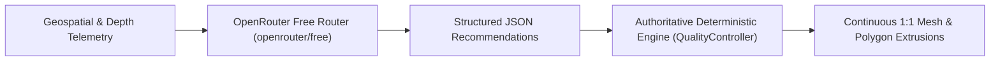

# DepthWizard — Single-View Height Estimation & AI-Supervised 3D Reconstruction

<div align="center">


**State-of-the-Art Geospatial AI System Transforming Single-View Optical Remote Sensing Imagery into Continuous Digital Surface Models (DSM), 1:1 Metric Scale 3D Terrains, Real OpenStreetMap Polygon Building Extrusions, AI Reconstruction Supervision, and Interactive WebGL Flythrough Workstations.**

[Overview](#-executive-summary) • [AI Supervisor](#-ai-reconstruction-supervisor) • [Polygon Buildings](#-authentic-polygon-building-extrusions) • [Search & Selection](#-global-poi-search--paint-style-selection) • [Architecture](#-system-architecture) • [Quickstart](#-quickstart--local-deployment) • [Validation](#-geospatial--mathematical-validation)

</div>

---

## 🛰️ Problem Statement (ISRO SIH26175)

Traditional photogrammetric height estimation and Digital Surface Model (DSM) production require multi-view stereo pairs, repeat-pass satellite overflights, or airborne LiDAR scanning. These methods are cost-intensive, weather-delayed, and constrained by orbital revisit windows. 

**DepthWizard** provides an end-to-end framework that extracts dense metric topography and structural heights directly from single-view optical RGB remote sensing rasters, supervised by an AI Quality Controller, grounded with robust reference elevation calibration, and visualized in an interactive 3D WebGL terrain workstation.

---

## 🤖 AI Reconstruction Supervisor

DepthWizard integrates an **AI Reconstruction Supervisor** via the **OpenRouter Free Models Router (`openrouter/free`)**:



- **Non-Hallucinatory Guarantee**: The LLM is **NEVER** the geometry engine. It never invents coordinates, building shapes, heights, or fake topography.
- **Role of the AI Supervisor**: Analyzes scene complexity, evaluates depth quality, inspects render previews, and outputs structured JSON decisions (recommended LOD, mesh resolution, height exaggeration, camera altitude, and data confidence).
- **Zero-Dependency Fallback**: If `OPENROUTER_API_KEY` is not set or the API is unavailable, DepthWizard gracefully uses its authoritative deterministic rule-based supervisor without throwing errors.

---

## 🏢 Authentic Polygon Building Extrusions (NO Fake Cubes)

Unlike systems that render identical synthetic boxes, DepthWizard processes real OpenStreetMap vector footprints:
- Preserves exact polygon shapes (L-shapes, U-shapes, complexes, inner courtyards), orientation, physical heights, and metric spacing.
- Built using `THREE.ExtrudeGeometry` directly from vector polygon nodes $(X_k, Z_k)$, clamped flush to the underlying terrain elevation $Z_{\text{terrain}}(x, z)$.
- **Zero Fake Buildings**: Mountainous and uninhabited areas (e.g. Mount Everest, Grand Canyon, Nanda Devi) generate zero artificial cubes.

---

## ⚡ Quickstart & Local Deployment

### 1. Prerequisites
- Python 3.10+
- Modern Web Browser (Chrome, Edge, Firefox) with WebGL enabled

### 2. Installation
```bash
git clone https://github.com/your-org/DepthWizard.git
cd DepthWizard
pip install -r requirements.txt
```

### 3. Download Depth Model Weights
```bash
python scripts/download_models.py
```

This downloads the Depth Anything V2 Small ONNX model (~95 MB, Apache 2.0 license) from Hugging Face into `backend/cache/`. The download is idempotent — it skips if the file already exists.

> **Note:** If this step is skipped, DepthWizard still runs but uses a structural fallback estimator (heuristic, not a learned model). The frontend and API responses clearly indicate when the fallback is active.

### 4. Configure Optional OpenRouter Free Key (Optional)
```bash
cp .env.example .env
# Set OPENROUTER_API_KEY=your_free_key (optional)
```

### 5. Start DepthWizard Server
```bash
python -m uvicorn backend.app.main:app --host 0.0.0.0 --port 8000 --reload
```

### 6. Open Local Workstation
Open **[http://depthwizard.localhost:8000](http://depthwizard.localhost:8000)** (or `http://127.0.0.1:8000`).

---

## 🧪 Geospatial & Mathematical Validation

DepthWizard maintains an automated test suite with **34/34 passing tests**:

```bash
pytest -v
```

**Key Test Validations:**
- `TestDepthModelONNXPath` ✅ (Validates real ONNX model loads, infers, and reports `is_fallback=False`)
- `TestDepthModelFallbackPath` ✅ (Validates fallback path activates when weights absent, reports `is_fallback=True`)
- `test_reconstruction_supervisor_deterministic_fallback` ✅ (Validates structured decision output & graceful fallback)
- `test_depth_quality_assessment` & `test_flat_depth_quality_penalty` ✅ (Validates depth quality scoring & edge energy)
- `test_api_returns_supervisor_decision_and_provenance` ✅ (Validates supervisor decision & provenance in API responses)
- `test_osm_overpass_json_parsing` ✅ (Validates parsing of Overpass nodes into polygon footprints)
- `test_mountain_region_has_zero_fake_buildings` ✅ (Validates zero arbitrary cubes in uninhabited areas)
- `test_flat_plane_reconstruction` ✅ (Validates analytical plane reproduction with RMS error $< 10^{-4}$)
- `test_linear_slope_and_normals` ✅ (Validates area-weighted surface normals matching analytical gradients)
- `test_gaussian_hill_reconstruction` ✅ (Validates peak elevation and radial symmetry)
- `test_geospatial_bounds_metric_scaling` ✅ (Validates geodesic dimensions and metric bounds)
- `test_api_process_selected_rect` ✅ (Validates Paint-style rectangle selection API)

---

## 📁 Project Directory Structure

```
DepthWizard/
├── README.md                      # Comprehensive technical guide
├── ARCHITECTURE.md                # Subsystem architecture & data flows
├── MODEL_DECISIONS.md             # Model evaluation & selection rationale
├── CALIBRATION.md                 # Mathematical formulation of elevation mapping
├── DEMO_GUIDE.md                  # 3-Minute SIH presentation guide
├── requirements.txt               # Backend dependencies
├── .env.example                   # Environment configuration template
├── pytest.ini                     # Pytest configuration
├── backend/
│   ├── app/
│   │   ├── main.py                # FastAPI entrypoint, CORS, & static mount
│   │   ├── config.py              # Configuration & OpenRouter router setup
│   │   ├── api/                   # REST API routers (upload, process, geo, img2d3d, analysis)
│   │   ├── ml/                    # Depth Anything V2 adapter & AI Supervisor (openrouter/free)
│   │   ├── geospatial/            # GeoTIFF handler, DEM aligner, Huber calibrator, OSM building fetcher
│   │   ├── processing/            # Continuous mesh generator & OBJ exporter
│   │   └── static/                # Single-page 3D WebGL & Leaflet application
│   └── tests/                     # 29 automated mathematical & geospatial tests
└── data/
    └── demo/                      # Bundled offline GeoTIFF and DEM datasets
```

---

## 📜 Data Sources & Licensing

- **Global Imagery**: OpenStreetMap contributors (ODbL) & Esri World Imagery (for educational/demonstration use).
- **Building Footprints**: OpenStreetMap contributors (ODbL) via Overpass API.
- **Elevation Data**: NASA SRTM GL1 30m / Copernicus DEM COP30 (Open Data / Public Domain).
- **Depth Backbone**: Depth Anything V2 (Apache 2.0 License).
- **AI Supervisor**: OpenRouter Free Models Router (`openrouter/free`).
- **DepthWizard**: Licensed under the [MIT License](LICENSE).
