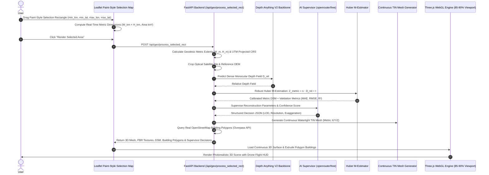

# DepthWizard — Architecture & Technical Specifications

## 1. System Overview
**DepthWizard** is an end-to-end geospatial machine learning system engineered for **ISRO Problem SIH26175**. It transforms single-view optical satellite and aerial imagery into continuous Digital Surface Models (DSM), 1:1 metric-scale 3D terrains, interactive 3D WebGL flythroughs, and 2D-to-3D reconstructions, supervised by an AI Quality Controller.

---

## 2. Ingestion & Transformation Pipelines

---

## 3. Subsystem Architecture

### AI Reconstruction Supervisor (`backend/app/ml/ai_supervisor.py`)
- **OpenRouter Free Router (`openrouter/free`)**:
  - Ingests scene telemetry, terrain relief, building count, DEM availability, and depth quality metrics.
  - Outputs validated JSON: `scene_type`, `terrain_complexity`, `urban_density`, `recommended_terrain_lod`, `recommended_mesh_resolution`, `recommended_height_exaggeration`, `data_confidence`.
- **Deterministic Rule-Based Fallback**:
  - If `OPENROUTER_API_KEY` is not set or network fails, the authoritative deterministic supervisor computes verified parameters seamlessly.

### Continuous Surface Mesh Engine (`backend/app/processing/mesh_generator.py`)
- **Metric Coordinate Transformation**:
  - Horizontal coordinates $X$ and $Z$ represent real East-West and South-North physical meters relative to the bounding box center:
    $$x_j = -\frac{W_m}{2} + j \cdot \frac{W_m}{W - 1}, \quad z_i = -\frac{H_m}{2} + i \cdot \frac{H_m}{H - 1}$$
  - Vertical height $Y$ represents true metric elevation relative to the local mean datum:
    $$y_{i,j} = \big(Z(i, j) - Z_{\text{mean}}\big) \cdot \kappa_{\text{exagg}}$$
- **Watertight Counter-Clockwise Triangulation**:
  - Continuous quad-splitting into indexed triangles $(P_{00}, P_{01}, P_{10})$ and $(P_{10}, P_{01}, P_{11})$ eliminates stepped cubes and surface gaps.
- **Area-Weighted Normal Field**:
  - Accumulates neighboring cross-product triangle face normals to provide smooth specular highlights and authentic slope-relief shading.

### Authentic Polygon Building Engine (`backend/app/geospatial/osm_buildings.py`)
- Queries OpenStreetMap Overpass API for real polygon nodes $(X_k, Z_k)$.
- Constructs `THREE.Shape` and `THREE.ExtrudeGeometry` with base vertices clamped to underlying terrain elevation $Z_{\text{terrain}}(x, z)$.
- Zero fake building guarantee on rural/mountain terrain.

### Backend API Architecture (`backend/app/api/`)
- `routes_geo.py`: Ingests exact bounding box, generates georeferenced raster/DEM, executes Huber calibration, queries OSM footprints, and evaluates AI supervisor decisions.
- `routes_img2d3d.py`: Zero-shot 2D photograph $\rightarrow$ 3D height-field mesh with depth quality assessment.
- `routes_upload.py`, `routes_process.py`, `routes_analysis.py`, `routes_demo.py`.

### Maximized 3D WebGL Workstation (`backend/app/static/index.html`)
- **Layering-Safe Search**: Dropdown rendered at `z-[9999]` above Leaflet tiles with live autocomplete and keyboard navigation.
- **Reconstruction Inspector**: Inspects real-time dataset provenance, sensor resolution, AI supervisor telemetry, and data confidence.
- **Dominant 85–90% Viewport**: Three.js WebGL2 PBR renderer with ACES Filmic tone mapping, PCF soft shadows, directional sunlight, and auto-framing camera.
- **Drone Flight HUD**: Real-time airspeed ($\text{m/s}$), altitude above ground ($\text{m}$), and heading compass with terrain collision avoidance.
